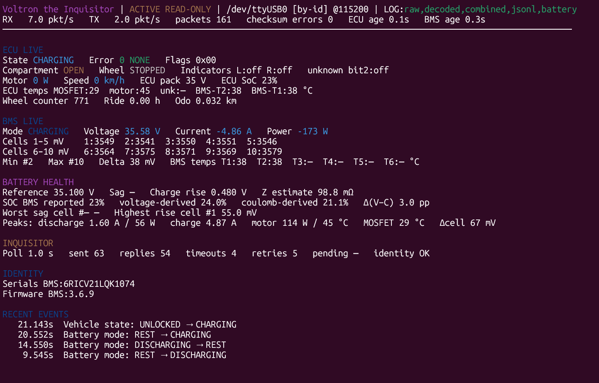

# miliVoltron UART Toolkit

A dependency-free Ninebot UART decoder, stable terminal dashboard, battery-health logger, and conservative read-only active poller.



*Inquisitor dashboard: ECU + BMS live view, battery health, and recent events.*

## Install

From a source checkout:

```bash
python3 -m venv .venv
source .venv/bin/activate
pip install .
```

Optional figure tooling is not part of the package; keep it in the source
checkout if needed.

Build distributable archives:

```bash
pip install build
python -m build
```

Artifacts land in `dist/` as a wheel and source tarball.

## Run

From a source tree, the launcher still works:

```bash
./mili-voltron.sh --dashboard
```

After install:

```bash
mili-voltron --dashboard
# or
python -m mili_voltron --dashboard
```

Installed runs use the built-in defaults. To override them, pass `--config path/to/mili-voltron.toml`.

## Modes

### Passive

Receives and decodes existing traffic. The USB-UART TX wire may remain disconnected.

```bash
./mili-voltron.sh --dashboard
```

The launcher automatically looks for, in order:

```text
/dev/serial/by-id/*
/dev/ttyUSB*
/dev/ttyACM*
```

If one port exists, it is selected automatically. If several exist, an interactive terminal shows a numbered choice; non-interactive use selects the first and prints a warning. `--port` always overrides detection.

### Voltron the Inquisitor

Active **read-only** master mode for a test rig without the IoT module:

```bash
./mili-voltron.sh \
  --mode inquisitor \
  --dashboard \
  --battery-log captures/battery-test.csv
```

Inquisitor sends only confirmed `RD` requests using source address `0x3D`. It
starts with a broad identity read, then polls two battery telemetry windows:

```text
BMS 0x30, 64 bytes — status, capacities, SOC, cells and surrounding raw registers
BMS 0x51,  6 bytes — PCB version and temperature sensors T3–T6
```

The 64-byte request size is confirmed by the reference captures and is the
maximum Inquisitor will request. Reading one broad window costs fewer request
and response turnarounds than several narrow reads. The default cycle is 1
second (1 Hz); that has been stable on this IoT-replacement tap (the stock IoT
cycle in captures is slower). Only one request is outstanding at a time;
replies are matched by source and index, with bounded timeout/retry handling.

The status bar always labels this mode `ACTIVE READ-ONLY`.

### BMS information dump

`--infodump` takes one active read-only snapshot of the known BMS register map,
prints a register table, writes matching CSV and JSON files, and exits:

```bash
./mili-voltron.sh --infodump
```

For a quick inspection without creating CSV, JSON, or configured communication
logs, use terminal-only mode:

```bash
./mili-voltron.sh --infodump --terminal-only
```

Unlike the original Voltron implementation, miliVoltron does not request every
named register separately. It uses four bounded reads covering `0x10..0x23`,
`0x30..0x49`, `0x50..0x53`, and `0x70..0x7B`. This captures the same known
fields, nearby unknown registers useful for reverse engineering, and the raw
bytes behind every interpretation with far fewer request/reply turnarounds.

Prefer running an infodump with the adapter connected directly to the battery's
communication port and without the ECU on the bus. This avoids unrelated ECU
traffic and gives the one-shot reader the cleanest request/reply path.

Infodumps are stored under `battery-log/` using the battery serial as the ID:

```text
battery-log/20260721-171530-BPECV22AAB1001.json
battery-log/20260721-171530-BPECV22AAB1001.csv
```

The terminal table puts units directly beside decoded values. The CSV contains
one logical register per row with `offset`, `var_name`, `interpreted_name`,
`decoded`, `hex`, `bin`, and `units`; active bitflags are joined with `|` so the
file stays flat and easy to filter in Excel. The JSON document adds capture
metadata, raw read windows, an identity/QC summary, and the complete definitions
of known bitflags, including inactive flags. Unknown active bits are preserved
explicitly. Interactive bitflag rendering remains a TODO. If one window times
out, miliVoltron still attempts the rest, prints and writes a partial dump with
unavailable rows marked, and exits with status 2. If the serial cannot be read,
the filename uses `unknown-battery` as the ID.

`--terminal-only` cannot be combined with `--quiet` or any explicit log-output
option. It also overrides log paths enabled in the configuration file, ensuring
that the command writes nothing to disk.

### ioTTY

`ioTTY` is reserved for a future full IoT-emulator mode: keepalives, configuration writes, lock/unlock, deploy/pickup, and other state-changing behavior. It is intentionally **not implemented** here and remains separate from Inquisitor.

## Dashboard

```bash
./mili-voltron.sh --dashboard --refresh-rate 5
```

The dashboard uses the terminal alternate screen and redraws in place, so the 10 Hz heartbeat does not become a scrolling strobe. Parsing and logging remain full-rate.

The top line shows:

- passive versus active read-only mode;
- selected serial port and baud rate;
- enabled logs;
- RX/TX packet rate and checksum errors;
- ECU/BMS data age;
- Inquisitor poll/reply/timeout counters when active.

The live view includes:

- ECU motor power, heartbeat temperatures (MOSFET / motor / BMS-T1/T2), speed, wheel movement, flags, state and errors;
- battery compartment and indicator states;
- BMS signed current, voltage and calculated power;
- all ten cell voltages and live delta;
- up to six polled BMS temperatures (T1–T6), kept separate from heartbeat BMS-T1/T2 copies;
- BMS-reported, voltage-derived and coulomb-derived SOC plus their delta;
- battery sag/charge-rise analytics and effective impedance estimate;
- battery/motor session peaks;
- discovered serial numbers and firmware.

`wheel_moving` is a live Boolean and is excluded from event history by default. The same is true for blinkers and continuously changing telemetry.

## Meaningful recent events

The default event list tracks:

- vehicle state;
- battery mode (`REST`, `DISCHARGING`, `CHARGING`);
- ECU error changes;
- battery-compartment state;
- BMS online/offline state;
- selected ECU flag-bit transitions.

It does **not** track wheel movement, indicator blinking, speed, current, power, voltage, or temperatures unless explicitly enabled.

## Configuration

The script automatically loads `mili-voltron.toml` beside the Python files. Another file can be selected with:

```bash
./mili-voltron.sh --config my-rig.toml --dashboard
```

Command-line arguments override TOML settings.

Example event policy:

```toml
[recent_changes]
vehicle_state = true
battery_mode = true
error_code = true
battery_latch = true
bms_link = true
wheel_moving = false
left_indicator = false
right_indicator = false

[recent_changes.flags]
bit_0 = false
bit_1 = true
bit_2 = true
bit_3 = false
bit_4 = false
bit_5 = true
bit_6 = true
bit_7 = true
```

Bit 2 remains semantically unknown. A discarded, very-low-confidence GPS-no-fix idea is preserved only in a source comment and is not shown as GPS information.

## Battery-health CSV

```bash
./mili-voltron.sh \
  --dashboard \
  --battery-log captures/battery-1729.csv
```

One row is written per coherent BMS telemetry cycle. Fast ECU motor-power and
MOSFET/motor-temperature values are aggregated between BMS samples.

The focused CSV records:

- battery serial and mode;
- BMS voltage, signed current and calculated power;
- ECU motor power latest/average/peak;
- ECU motor and MOSFET radiator temperatures latest/peak;
- ECU- and BMS-reported SOC;
- BMS coulomb- and voltage-derived capacities;
- SOC estimates derived from design capacity and their percentage-point delta;
- raw register `0x3B` for evidence only (it is not treated as meaningful health);
- all ten cells, min/max cell and delta;
- up to six BMS temperatures;
- resting reference voltage;
- discharge sag or charging rise;
- effective pack-path impedance estimate;
- worst cell sag or highest cell rise.

It deliberately omits speed, odometer, lock state, errors and indicators.
Column names distinguish direct scooter/BMS values with `reported` from
miliVoltron calculations with `derived`.

### Current sign

```text
current > 0  battery discharging
current < 0  battery charging
power = voltage × current
```

ECU vehicle state `20` is confirmed as `CHARGING` by repeated charger plug/unplug tests.

### Sag baseline

A baseline is established after at least two complete samples within the
configured idle-current threshold (1.5 A by default) and is frozen during load
or charging:

```text
discharge sag = resting voltage - loaded voltage
charge rise   = charging voltage - resting voltage
Z estimate    = voltage change / |current|
```

The estimate includes the whole pack path: cells, interconnects, welds, fuse, BMS MOSFETs, contacts and rig wiring.

## Ordinary logs

```bash
./mili-voltron.sh --all-logs captures/boot
```

Creates:

```text
captures/boot.raw.log
captures/boot.decoded.log
captures/boot.combined.log
captures/boot.jsonl
```

The dashboard status bar reports which logs are active.

## Replay

```bash
./mili-voltron.sh --binary capture.bin --all-logs captures/replay
./mili-voltron.sh --hex pasted-frames.txt --no-color
```

Inquisitor mode is live-serial only.

## Module layout

```text
mili_voltron.py          framing, decoder, serial loop, dashboard and logs
mili_voltron_defs.py     static protocol names, states, masks and errors
mili_voltron_battery.py  coherent BMS samples, sag analytics and battery CSV
mili_voltron_config.py   small TOML loader and defaults
mili_voltron_infodump.py one-shot BMS register capture, terminal view and CSV/JSON export
mili_voltron_polling.py  frame builder and read-only Inquisitor scheduler
mili-voltron.sh          WSL/Linux launcher and serial-port selection
mili-voltron.toml        editable defaults
```

## Current heartbeat map

Offsets are relative to the 25-byte ECU heartbeat payload.

| Offset | Type | Meaning |
|---:|---|---|
| 0–1 | `i16le` | signed ECU motor-power estimate, strongly supported as watts |
| 2–3 | `u16le` | low-resolution pack voltage in whole volts |
| 4 | `u8` | battery SoC |
| 5 | `u8` | state: `4 UNLOCKED`, `5 LOCKED`, `20 CHARGING` |
| 6 | bitfield | ECU live flags |
| 7 | `u8` | ECU error code |
| 8 | `u8` | unknown secondary status/alarm byte |
| 9 | `u8` | speed in km/h; also rendered as live `wheel_moving` Boolean |
| 10–11 | `u16le` | high-resolution wheel/movement counter, unit unknown |
| 12 | `u8` | MOSFET radiator plate temperature (°C); `0` = absent |
| 13 | `u8` | motor temperature (°C); `0` = absent |
| 14 | `u8` | unknown temperature slot; `0` on this model (no sensor) |
| 15 | `u8` | heartbeat echo of BMS T2 (°C); keep separate from polled BMS temps |
| 16 | `u8` | heartbeat echo of BMS T1 (°C); keep separate from polled BMS temps |
| 17–20 | `u32le` | cumulative ride time in seconds |
| 21–24 | `u32le` | odometer in metres |

Known flag bits:

| Bit | Mask | Meaning |
|---:|---:|---|
| 0 | `0x01` | battery compartment closed |
| 2 | `0x04` | unknown persistent flag |
| 3 | `0x08` | left indicator currently illuminated |
| 4 | `0x10` | right indicator currently illuminated |

## Wiring and safety

Passive mode:

- scooter UART output → adapter RX;
- common ground;
- adapter TX disconnected.

Inquisitor mode additionally connects adapter TX to the former IoT TX line. Use confirmed 3.3 V logic and common ground. A small series resistor in the initial TX setup is sensible. Inquisitor transmits read requests only.

### WSL: forward a USB serial adapter with usbipd

WSL 2 does not see host USB devices by default. Use
[usbipd-win](https://github.com/dorssel/usbipd-win) on Windows to attach the
adapter; inside WSL it then appears as an ordinary `/dev/ttyUSB*` (or
`/dev/ttyACM*`) device.

Install with winget (recommended). Prefer `--interactive` so Windows does not
restart without prompting if a driver install requires it:

```powershell
winget install --interactive --exact dorssel.usbipd-win
```

Keep a WSL terminal open so the WSL 2 VM stays running, then in PowerShell:

```powershell
usbipd list
usbipd bind --busid <BUSID>          # elevated / admin once to share the device
usbipd attach --wsl --busid <BUSID>  # attach to WSL (no admin needed)
```

Verify inside WSL:

```bash
lsusb
ls -l /dev/ttyUSB* /dev/ttyACM* /dev/serial/by-id/
```

Detach when finished (or when unplugging / restarting WSL):

```powershell
usbipd detach --busid <BUSID>
```

While attached to WSL, Windows cannot use the same adapter. If attach fails with
a USBIP/kernel error, update WSL first: `wsl --update`.

### Dashboard readability

The dashboard clears every terminal line before redrawing it, preventing stale
suffixes when values become shorter. Long `/dev/serial/by-id/...` paths are
shown using the resolved `/dev/ttyUSB*` name with a `[by-id]` marker. Cell
voltages are split across two rows, and empty BMS/health sections show one
waiting message instead of a wall of placeholders.

## Battery baseline and automatic log names

Battery REST detection uses both BMS current and ECU motor power. Defaults are
1.5 A maximum idle current, 20 W maximum motor power, and two coherent samples
to establish a resting reference. These values are configurable under
`[battery]` in `mili-voltron.toml`.

Logging stays opt-in, but prefixes no longer need to be typed every run:

```bash
./mili-voltron.sh --inquisitor --dashboard --all-logs --battery-log
```

The default configuration creates one timestamped communication-log set under
`comm-logs/` and one battery CSV under `battery-log/`. Infodump CSV/JSON files
also go under `battery-log/`. Supplying an optional prefix overrides the config
for ordinary logs:

```bash
./mili-voltron.sh --all-logs experiment/run01 --battery-log experiment/bt01
```

Extensions, directories, timestamps, and collision suffixes are completed
automatically.

### BMS identity and reconnection

Inquisitor requests BMS register `0x10` as a 24-byte block through register
`0x1B`. Bytes 0–13 are the 14-character battery serial, bytes 14–15 are the BMS
firmware word, and the window also captures design/current full capacity plus
the low-confidence raw `0x1A` and `0x1B` values.

When BMS traffic becomes stale, Voltron invalidates the current battery
identity and resting reference. After the first successful BMS reply on
recovery, the identity request is inserted ahead of the remaining telemetry
requests. This prevents a newly connected battery from being logged
under the previous battery's serial or baseline.

## Tests

The test suite uses only the Python standard library:

```bash
python3 -m unittest discover -s tests -v
```

Fast protocol and poller tests run without hardware. Sanitized replay captures
can be added under `tests/fixtures/logs`; supported formats and anonymization
guidance are documented in that directory. Capture-based tests are skipped
until fixtures are present.

GitHub Actions runs the suite on Python 3.11, 3.12, and 3.13.

## Figures (optional, source checkout only)

`make_figures.py` is a local post-processing helper for battery CSV logs. It is
not included in the installable package. It needs pandas, numpy, and matplotlib
in a separate virtualenv:

```bash
python3 -m venv .venv
source .venv/bin/activate
pip install -r requirements-figures.txt
python make_figures.py battery-log/SESSION.csv -o figures/
```

`.venv/` is gitignored.
